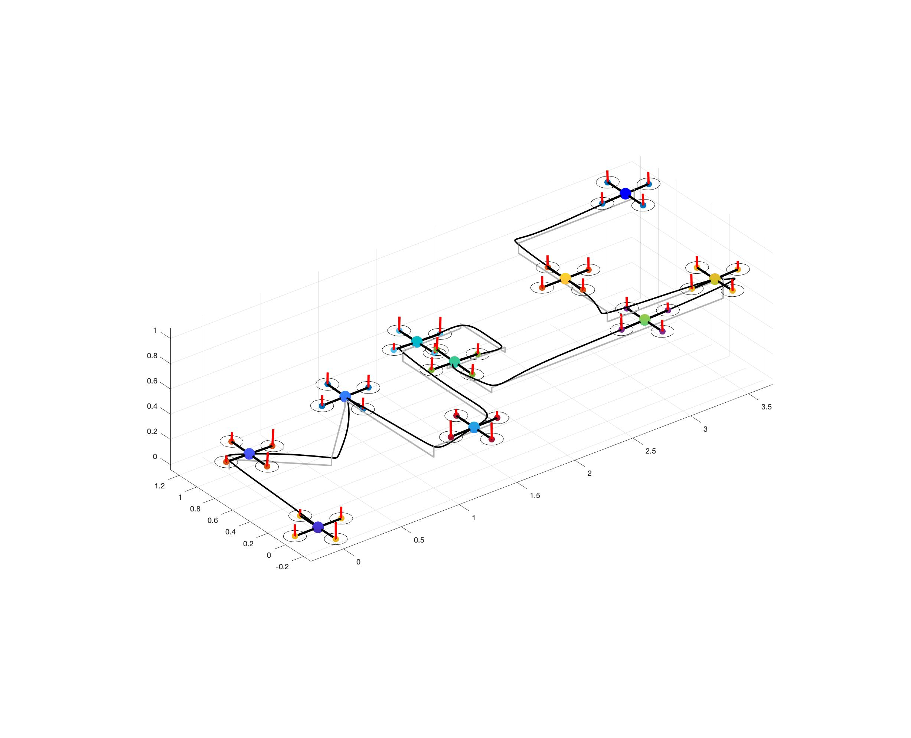

# ME-425 Project 2020

MPC control of a quadcopter. Two different algorithms 

### 1 Offset-Free linear tracking MPC controllers

Implementation of 4 linear tracking (offset-free) MPCs to control 4 independant (under the conditions of linearization) subsystems for **x**,  **y**, **z** and **yaw**.

### 2 Non Linear tracking MPC (NMPC)

Non linear MPC implementation.